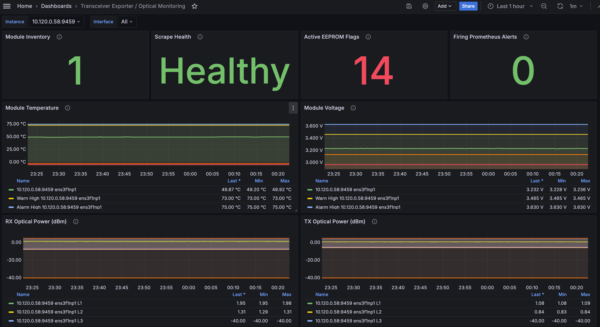
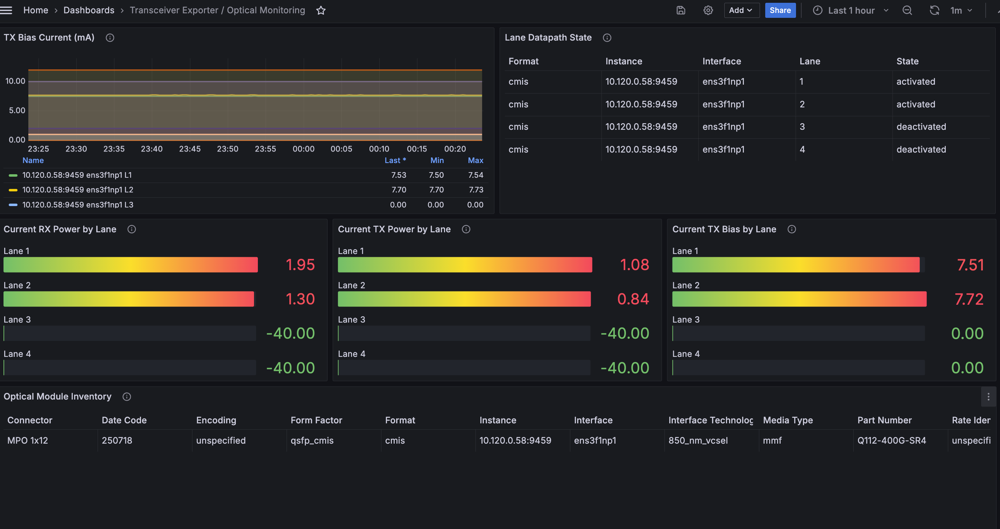
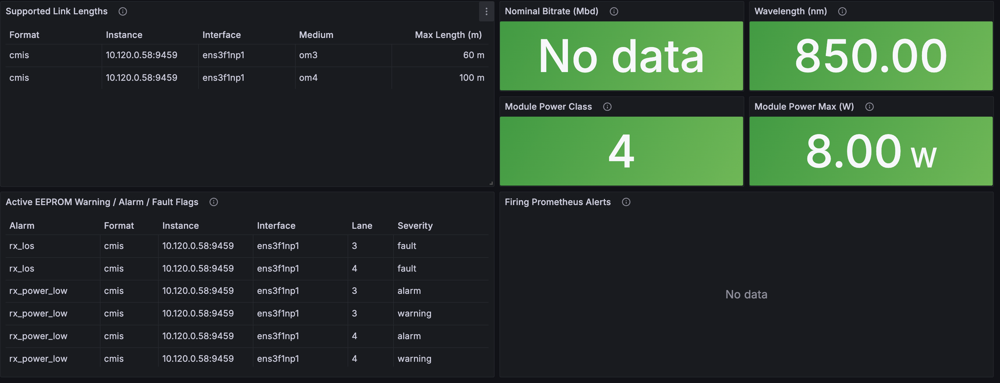

# transceiver_exporter

Prometheus exporter for transceiver EEPROM telemetry exposed through the Linux
ethtool API.

The implementation decodes SFF-8472 SFP/SFP+ modules, SFF-8636
QSFP/QSFP+/QSFP28 modules, and CMIS modules. It exports decoded gauges for
module temperature, voltage, TX bias, TX optical power, RX optical power,
diagnostic thresholds, module/lane state, static inventory, and alarm/warning
status.

## Binaries

- `transceiver_exporter`: HTTP exporter, defaulting to `:9459` and `/metrics`.
  It uses Prometheus exporter-toolkit web flags, including TLS/basic-auth
  configuration through `--web.config.file`.
- `transceiverctl`: small inspection CLI for live module reads.

## Metrics

- `transceiver_temperature_celsius`
- `transceiver_voltage_volts`
- `transceiver_tx_bias_milliamps`
- `transceiver_tx_power_milliwatts`
- `transceiver_tx_power_dbm`
- `transceiver_rx_power_milliwatts`
- `transceiver_rx_power_dbm`
- `transceiver_diagnostic_threshold`
- `transceiver_alarm_status` with module-level alarms using an empty `lane`
  label and per-lane alarms using the lane number
- `transceiver_scrape_success`
- `transceiver_module_status`
- `transceiver_module_low_power_status`
- `transceiver_lane_datapath_state`
- `transceiver_module_info`
- `transceiver_wavelength_nanometers`
- `transceiver_wavelength_tolerance_nanometers`
- `transceiver_module_power_class`
- `transceiver_module_power_max_watts`
- `transceiver_nominal_bitrate_mbd`
- `transceiver_link_length_meters`

Dynamic metrics intentionally avoid module identity labels such as vendor, part
number, and serial number. Those labels live on `transceiver_module_info` so
Prometheus can join them into alerts without multiplying every time series by
replaceable module identity.

## Mixin

The `mixin/` directory contains a Prometheus mixin with alert rules, a Grafana
dashboard, and `promtool` unit tests. Lane-scoped alarm alerts are gated by
`transceiver_lane_datapath_state{state="activated"}` so intentionally inactive
lanes do not page on optical power or loss-of-signal flags.

```sh
jsonnet -S mixin/alerts.jsonnet > mixin/prometheus_alerts.yaml
./hack/render-dashboards.sh
(cd mixin && promtool test rules tests.yml)
```

The generated alert rules are also checked into
`charts/transceiver-exporter/files/prometheus-alerts.yaml` for the Helm chart.
The generated dashboard is checked into `grafana/`. Run
`./hack/render-alerts.sh` and `./hack/render-dashboards.sh` after editing the
mixin.

Example Grafana panels from the generated dashboard:







## Container Image

The repository includes a GoReleaser-compatible `Dockerfile` for the exporter
binary. GoReleaser builds the Linux binaries first, then creates the container
image from those prebuilt artifacts instead of rebuilding inside Docker.

```sh
goreleaser release --snapshot --clean --skip=publish
```

Tagged releases publish GitHub release archives/checksums plus
`ghcr.io/vexxhost/transceiver-exporter` image tags.

## Helm Chart

The chart lives in `charts/transceiver-exporter`. It deploys the exporter as a
host-networked DaemonSet and intentionally uses a PodMonitor instead of a
ServiceMonitor.

```sh
helm install transceiver-exporter charts/transceiver-exporter \
  -n monitoring \
  --set podMonitor.enabled=true \
  --set podMonitor.additionalLabels.release=kube-prometheus-stack \
  --set prometheusRule.enabled=true \
  --set prometheusRule.namespace=monitoring \
  --set prometheusRule.additionalLabels.release=kube-prometheus-stack
```

## Development

```sh
CGO_ENABLED=0 go test ./...
```

`collector` contains the Prometheus collector wiring. `pkg/transceiver`
contains the clean public domain model. Live EEPROM reads use
`github.com/safchain/ethtool` through `pkg/moduleeeprom`, while `pkg/sff` owns
standards-specific EEPROM decoding.

Reusable packages live under `pkg/` so they can be imported by other components
or split into their own modules later without changing the internal package
boundaries first.

- `collector`: Prometheus collector wiring.
- `pkg/moduleeeprom`: live EEPROM reads through ethtool ioctl/netlink.
- `pkg/sff`: standards-specific EEPROM decoding.
- `pkg/transceiver`: decoded module domain model.
- `pkg/netdev`: candidate network device discovery.
- `pkg/transceiverctl`: reusable inspection command runner.

Common library entry points:

- `moduleeeprom.New` opens an ethtool-backed reader.
- `(*moduleeeprom.Reader).ModuleEEPROM` reads raw EEPROM bytes for an
  interface.
- `sff.Decode` decodes EEPROM bytes into a `transceiver.Module`.
- `sff.DecodeObservation` decodes EEPROM bytes and attaches an interface name.
- `collector.NewTransceiverCollector` exposes decoded readings as Prometheus
  metrics.

EEPROM fixture directories live under `pkg/sff/testdata` and use the pattern
`standard-formfactor-media-variant`, for example `sff8472-sfp-copper-passive`
or `cmis-qsfp-plus-lower-page-a`. Each fixture directory is discovered
automatically by the SFF tests and should only contain files used by those
tests. Pretty ethtool fixtures use `eeprom.bin` plus `ethtool.txt`; raw ethtool
offset dumps can use `ethtool.txt` by itself because the test parses the EEPROM
bytes from the dump.
